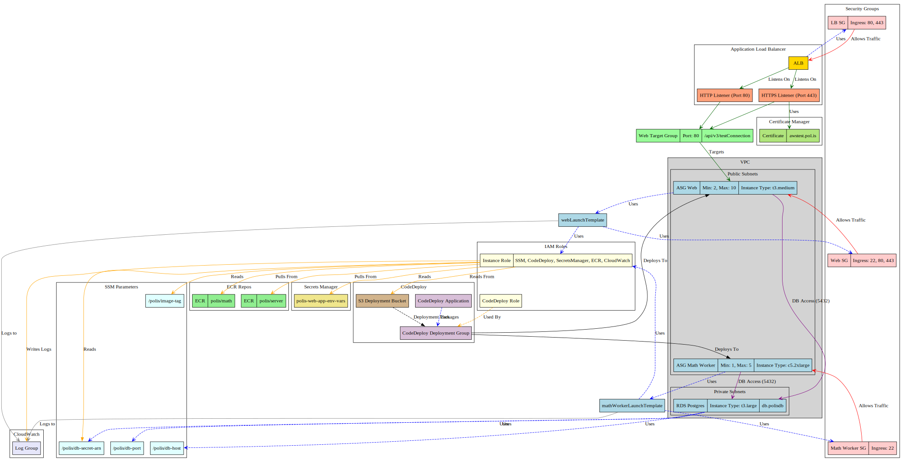

# Pol.is AWS Platform Architecture with CDK

## General Layout Explanation

This code defines the infrastructure for running the Pol.is application on AWS using the AWS Cloud Development Kit (CDK).  The core application consists of web servers and math workers, both running as Docker containers within EC2 instances.  These instances are managed by Auto Scaling Groups (ASGs) for scalability and resilience. The application utilizes an AWS RDS PostgreSQL database for persistent storage.

**Key Components:**

*   **EC2 Instances:**
    *   **Web Servers:** A minimum of 2 EC2 instances (`t3.medium`) run Docker containers serving the web application. They are publicly accessible via an Application Load Balancer (ALB).
    *   **Math Workers:** A minimum of 1 EC2 instance (`c5.2xlarge`) runs Docker containers performing mathematical computations. These instances are *not* directly accessible from the internet.
*   **Auto Scaling Groups (ASGs):** Separate ASGs manage the web servers and math workers, allowing for independent scaling.
*   **Application Load Balancer (ALB):** An ALB distributes incoming HTTP/HTTPS traffic to the web server instances.
*   **RDS PostgreSQL Database:** A managed PostgreSQL database (`t3.large`) provides persistent data storage. The database is placed in a private subnet for enhanced security.
*   **Virtual Private Cloud (VPC):** All resources are contained within a VPC, with public subnets for the web servers and math workers, and private, isolated subnets for the database.
*   **Security Groups:**  Separate security groups control network access:
    *   **Web Security Group:** Allows inbound traffic on ports 80 (HTTP), 443 (HTTPS), and 22 (SSH - conditionally enabled).
    *   **Math Worker Security Group:** Allows inbound traffic on port 22 (SSH - conditionally enabled).
    *   **Load Balancer Security Group:** Allows inbound traffic on ports 80 (HTTP) and 443 (HTTPS).
*   **Secrets Management:** Application secrets and environment variables are stored in AWS Secrets Manager.
*   **Logging:** Log output from the web and math worker containers is sent to a CloudWatch log group.
*   **Container Registry:**  Docker images for the web server and math worker are stored in Amazon Elastic Container Registry (ECR).
* **SSM Parameters:** Used to store database connection details like host, port, and the secret ARN, as well as the application's Docker image tag.

## Deployment Process

The deployment process is orchestrated via GitHub Actions:

1.  **Build Docker Images:** A GitHub Action builds Docker containers for the web server and math worker.
2.  **Push to ECR:** The newly built images are pushed to their respective ECR repositories.  The image tag is managed via an SSM Parameter.
3.  **Trigger CodeDeploy:** The GitHub Action triggers a CodeDeploy deployment. This involves:
    *   Stopping and removing existing Docker containers on the EC2 instances.
    *   Pulling the latest Docker images from ECR.
    *   Starting new containers based on the updated images.
4. **Scripts Folder**: The /scripts folder (referenced in the user data) is not described in the CDK file, this folder should contain scripts that:
    * Pull environment variables and the secret from AWS Systems Manager Parameter Store and Secrets Manager.
    * Run the docker containers

## Important Considerations

*   **Direct EC2 Access:** If necessary, you can connect to the EC2 instances directly via the EC2 console (using EC2 Instance Connect or SSH, if enabled).
*   **UserData and Instance Refreshes:** UserData scripts are executed *only* when an EC2 instance is initially launched.  Changes to UserData do *not* automatically apply to running instances. To apply UserData changes, you must perform an instance refresh through the Auto Scaling Group console. This will replace existing instances with new ones using the updated configuration.
*   **Health Checks:**  Health checks are configured on the Application Load Balancer's target group, pointing to `/api/v3/testConnection`. These health checks determine the health of the *web server* instances.  The CDK code does *not* define custom health checks for the math worker instances, relying instead on the default EC2 instance status checks.
*   **Race Condition:** A potential race condition exists during CDK updates that modify the EC2 instance configuration (e.g., changes to the launch template, security groups, or UserData). If a CDK update causes the EC2 instances to fail during launch, the ASG will continuously attempt to launch new instances, while CodeDeploy will be waiting for these instances to become healthy.  This can lead to a deployment deadlock.  *Thoroughly review and test any changes to the EC2 instance configuration before deploying to production.*
*   **Environment Variables:** Environment variables and secrets for the application should be managed through AWS Secrets Manager (specifically, the `polis-web-app-env-vars` secret).
* **Database Credentials**: RDS database credentials are created from a generated secret. The ARN of this secret, along with database host and port are stored in SSM Parameters.

## CDK Specifics

* **VPC Configuration:** The VPC is configured with two availability zones, no NAT gateways, and public and private isolated subnets.
* **Instance Types:** Web servers use `t3.medium`, and math workers use `c5.2xlarge`. The database uses a `t3.large`.
* **Key Pairs:** EC2 key pairs (`webKeyPair` and `mathWorkerKeyPair`) are created or imported *only if* `enableSSHAccess` is set to `true`.  This allows for SSH access to the instances.
* **IAM Roles:**
    *   An `instanceRole` grants permissions to EC2 instances to access SSM, CodeDeploy, Secrets Manager, ECR, and CloudWatch Logs.
    *   A `codeDeployRole` grants permissions to CodeDeploy to manage deployments.
* **CodeDeploy Configuration:** CodeDeploy is configured with a `ServerApplication` and a `ServerDeploymentGroup` that targets both the web server and math worker ASGs.  The deployment configuration is `ONE_AT_A_TIME`.
* **Log Group:** A CloudWatch log group is created, and the Docker daemon on each EC2 instance is configured to send logs to this group.